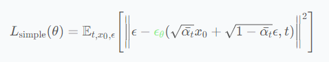

# Unet-Denoising-Diffusion-Probabilistic-Models

- The code comes from  [Labml](https://nn.labml.ai/diffusion/ddpm/index.html), a very clear DDPM implementation, I moved the code here mainly for learning, and added some comments to the code.
- The original paper [Denoising Diffusion Probabilistic Models](https://arxiv.org/abs/2006.11239), also **recommend a very good DDPM explanatory article from Google** : [Luo C. Understanding diffusion models: A unified perspective](https://arxiv.org/abs/2208.11970) . 
---
- The main structure of the model
	- [Unet](https://arxiv.org/abs/1505.04597) : Used to generate $\epsilon_t$ ,   which is based on $x_t$ and a random index $t$ step that for get the time step embedding .
	- For  $x_t$  ,  you  can get  it by flowing formula :
		- $q(x_t|x_0) = \mathcal{N} \Big(x_t; \sqrt{\bar\alpha_t} x_0, (1-\bar\alpha_t) \mathbf{I} \Big)$
	- The loss 
		- 
	- For more details of the model, please refer to 
		- 	 [1] [Labml](https://nn.labml.ai/diffusion/ddpm/index.html) 
		- 	 [2] [Denoising Diffusion Probabilistic Models](https://arxiv.org/abs/2006.11239) 
		- 	 [3] [Luo C. Understanding diffusion models: A unified perspective](https://arxiv.org/abs/2208.11970) 
